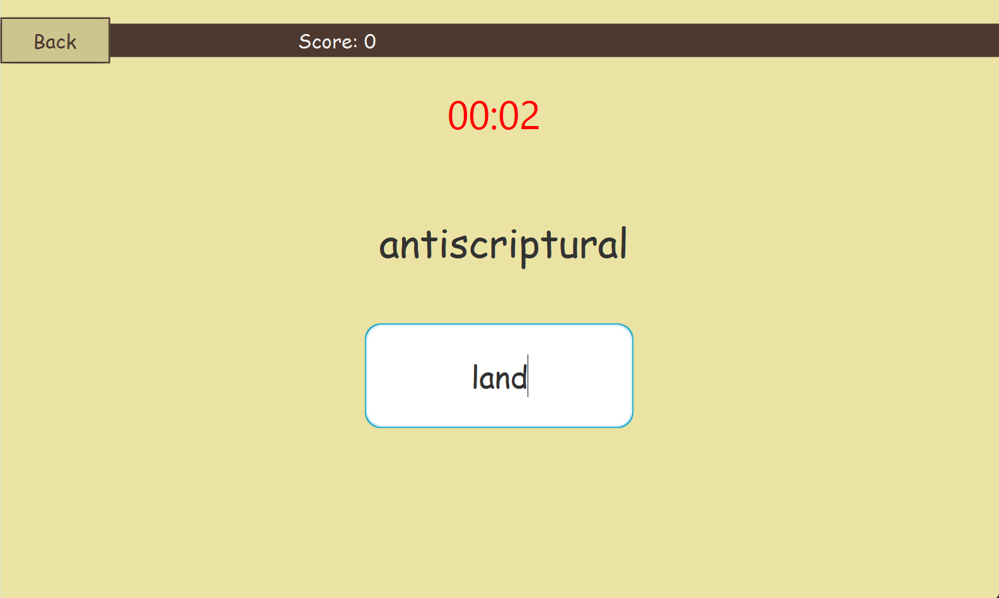

# Dictionary App
Final project - Group 6 - 2324II_INT2204_1 - UET

#### Table of contents
1. [Giới thiệu](#introduction)
2. [Tính năng nổi bật](#features)
3. [Cách sử dụng](#user-guide)
4. [Cây kế thừa](#inheritance-tree)
5. [Cài đặt](#installation)

# 1.    Giới thiệu 
* Ứng dụng từ điển giúp cho người dùng có thể tra cứu, học từ vựng tiếng Anh một cách nhanh và hiệu quả nhất.
* Ứng dụng được viết bằng ngôn ngữ Java và sử dụng thư viện JavaFX và SceneBuilder để hỗ trợ tạo giao diện đồ hoạ.
* Ứng dụng có các game thú vị để có thể học mà chơi, chơi mà học: Hang Man, Maching Word, Multiple Choice.
* Nhóm 6 - Các thành viên: Phạm Văn Đức, Hoàng Trung Hiệp & Đinh Văn Khải K66k

# 2.    Tính năng nổi bật 
Tìm từ, mỗi khi gõ kí tự vào ô tìm kiếm, ứng dụng sẽ tự động đề xuất những từ bắt đầu bằng những kí tự đã nhập vào. Nếu từ nhập vào không có trong từ điển, ứng dụng sẽ đề xuất những từ gần giống với từ nhập vào đó.
* Với mỗi từ sẽ có phần giải nghĩa hiển thị ở bên phải của khu vực chứa danh sách các từ tìm kiếm.
* Ứng dụng cho phép người dùng chuyển đổi từ điển, có thể dịch đa ngôn ngữ (Tiếng Anh, Tiếng Việt, Tiếng Pháp, Tiếng Trung), kiểu mặc định là dịch sang ngôn ngữ Tiếng Anh.
* Ứng dụng có chức năng thêm, xoá hoặc sửa lại nghĩa của từ vựng. Những thay đổi này sẽ được cập nhật vào dữ liệu từ điển của ứng dụng. Không thêm được từ đã có sẵn trong từ điển mà chỉ có thể chỉnh sửa nghĩa của từ đó nếu muốn.

* Một tính năng nữa của ứng dụng đó là phát âm từ vựng. Ở mỗi phần giải nghĩa của từ tiếng Anh, có giọng đọc là sử dụng API Google nên khuyến cáo nếu có đường truyển mạng tốt sẽ nhanh hơn.
* Người sử dụng có thể tra cứu từ vựng trực tiếp từ dữ liệu của ứng dụng hoặc có thể sử dụng Google API để dịch từ hoặc câu như ứng dụng Google Translate.
* Ở phần dịch Google API, ở mỗi ô văn bản cũng đều có chức năng phát âm, lưu ý chức năng này chỉ phát âm được các từ La-tinh nói chung.

* Có 3 game chơi để luyện việc học từ vựng Tiếng Anh:

>> Game Hang Man: Người chơi đoán các chữ cái còn thiếu của từ. Nếu đoán sai thì sẽ bị trừ điểm và các bộ phận trên cơ thể sẽ bị cắt dần . Đoán đúng thì được cộng điểm.

>> Game Matching Word: Người chơi sẽ điền từ với chữ cái bắt đầu là từ 
> cuối cùng của từ hiện trên màn hình. Nếu đoán đúng thì cộng điểm, sai thì bị trừ mạng.
> Nếu đoán sai hết mạng thì sẽ thua cuộc đồng thời chỉ có tối đa 20s để đưa ra câu trả lời.

>> Game Multiple Choice: Người chơi sẽ chọn 1 trong 4 đáp án để điền vào chỗ trống. Có tối đa 20s để chọn phương án đúng.

# 3.    Cách sử dụng 

* Clone github về máy : [Github](https://github.com/Dinh-Van-Khai/dictionary-oop.git)
* Bạn chạy đồ họa bằng MAVEN --> Dictionary --> Plugins --> javafx --> run (chạy qua Dictionary Application).

# 4.    Cây kế thừa 
Biểu đồ lớp (class diagram) dưới đây thể hiện tất cả các lớp được sử dụng và mối quan hệ kế thừa giữa chúng.

# 5.    Cài đặt 

* Cài đặt JDK 20 trở lên tại [đây](https://www.oracle.com/java/technologies/javase/jdk20-archive-downloads.html), có thể sử dụng Intellij, Eclipse, Netbean hoặc VSCode để chạy chương trình viết bằng Java.
* Cài đặt MAVEN framework tại [đây](https://maven.apache.org/download.cgi?.).
* IntelliJ IDEA Ultimate Edition 2024.1 tại [đây](https://www.jetbrains.com/idea/download/?section=windows)
* Scene Builder 21 tại [đây](https://gluonhq.com/products/scene-builder/)
* JavaFX vesion 21
* FreeTTS 1.2.2 Library
* gson-Simple 2.8.8 Library